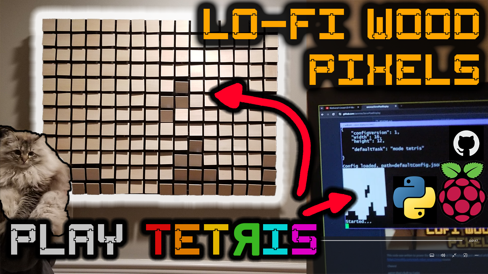
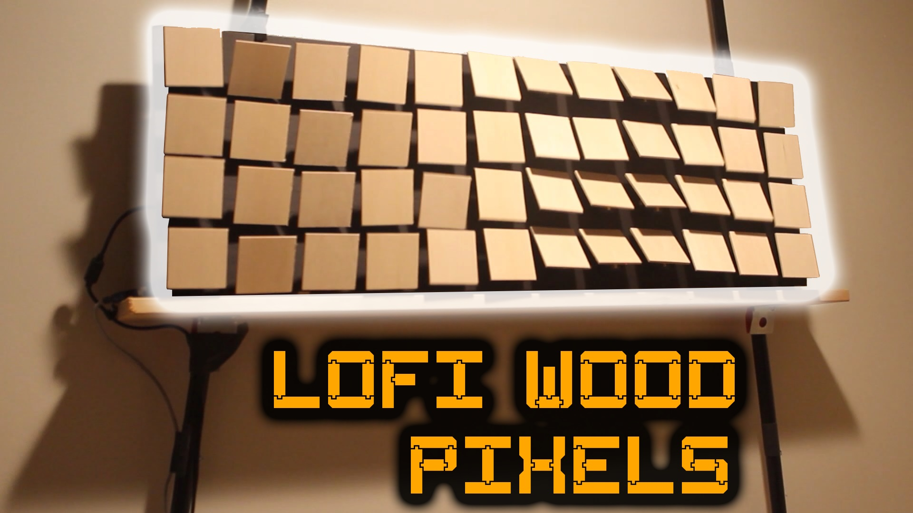

  # Multiverse's Lowest LO-FI Wood Pixel Display—Arduino Art 
  Lowest LOFI display in the known 10 hyper dimensional multiverse, that I've seen.  Wood based tech art.

  # WTD 2.0 — 192 pixel wood tile display (Raspberry Pi Python code)
  
  2min intro/teaser at [WTD 2.0 LO-FI Wood Pixel 40" Display, 192 servos —  Tetris, or Art (Raspberry Pi)](https://www.youtube.com/watch?v=Xzip1Ln_CbA)

  ## WTD 2.0 Parts

  - 192 SG90 9g Servos, consider ordering additional ~5%, personally found around this many to not work, or not work well. Am using Miuzei SG90 9g servos https://www.amazon.com/gp/product/B072V529YD
  - Velcro 8" x 1/2" cable ties to wrangle and tidy up wiring, https://www.amazon.com/gp/product/B001E1Y5O6
  - Cord Protector Wire Loom Tubing, e.g. 1/2" like https://www.amazon.com/gp/product/B07FXF12HC
  - 22AWG 6 pin wire cable to connect https://www.amazon.com/gp/product/B07T6LCZKJ
  - PCA9685 16 Channel Servo Driver, personally [ordered and tried a few different versions](img/parts-pca9685-16ch-servo-driver.png) after running into problems with some of the PCA9685 boards, ⚠️ watch [smoking PCA9685 YouTube Short](https://www.youtube.com/shorts/FOoa_OAFeZs), looks like the MOSFETs that some PCA9685 boards have (for reverse voltage protection) can get really hot, blue smoke and die when large current is drawn.  Shared more details on this and related info in the [V1E Forum Topic - Blue smoke ‘n Fire fun with I2C 16 Channel PCA9685 Servo board with SG90](https://forum.v1e.com/t/blue-smoke-n-fire-fun-with-i2c-16-channel-pca9685-servo-board-with-sg90/42481). 

  ## WTD 2.0 Design
  
  TODO:...

  ## WTD 2.0 Code

  - Python based code at [src/wtd_2/...](src/wtd_2/), basic patterns and Tetris.  Written to run on Raspberry Pi. 

  # WTD 1.0 — 48 pixel wood tile prototype display (Arduino C code)
  Watch https://www.youtube.com/watch?v=4f1J5LzRdIo for usage and build information.
  
  
  
  This code was written to power the WTD 1.0 (Wood Tile Display) project 
  created while participating in Mark Rober's 
  https://monthly.com/mark-rober-engineering course.
  

  ## WTD 1.0 Parts
  - [SG90 Arm Angle 10.stl](models/SG90%20Arm%20Angle%2010.stl)
  <!-- https://github.com/aaronse/ServoPixelDisplay/blob/main/models/SG90%20Arm%20Angle%2010.stl -->
  

  ## WTD 1.0 Design 

  Backside view of the rats nest wiring.  Note the WAGO connectors, 16awg for power, and skinny wiring for data lines.  v1.0 was (under) powered by a 5v 5amp Alitov power adapter.
  

  ## WTD 1.0 Code
  [src/wtd_1/wtd_1.ino](src/wtd_1/wtd_1.ino)
  - Displays Wave pattern by default.  Pause/Resume by sending "1" via Serial Monitor.  Edit _mode to change default start mode.

  ## Related work/projects
  
- https://github.com/julienp17/WaveMirror (reco by https://github.com/scorto)
- "Reflection" - Making of an art installation for Prague Signal Festival, https://www.youtube.com/watch?v=jHo4l41cz8s
