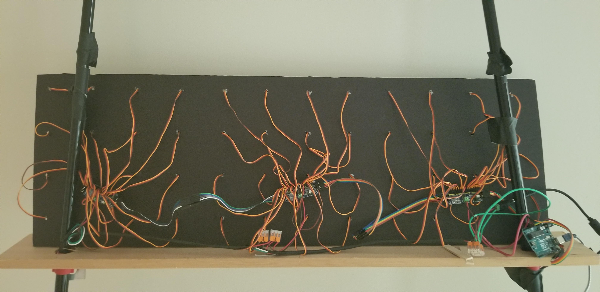

  # Multiverse's Lowest LO-FI Wood Pixel Display—Arduino Art 
  Lowest LOFI display in the known 10 hyper dimensional multiverse, that I've seen.  Wood based tech art.

  # WTD 2.0 — 192 pixel wood tile display (Raspberry Pi Python code)
  
  2min intro/teaser at [WTD 2.0 LO-FI Wood Pixel 40" Display, 192 servos —  Tetris, or Art (Raspberry Pi)](https://www.youtube.com/watch?v=Xzip1Ln_CbA)

  ## WTD 2.0 Parts

  TODO:...

  ## WTD 2.0 Design
  
  TODO:...

  ## WTD 2.0 Code

  - Python based code at [src/wtd_2/...](src/wtd_2/), basic patterns and Tetris.  Written to run on Raspberry Pi. 

  # WTD 1.0 — 48 pixel wood tile prototype display (Arduino C code)
  Watch https://www.youtube.com/watch?v=4f1J5LzRdIo for usage and build information.
  
  
  
  This code was written to power the WTD 1.0 (Wood Tile Display) project 
  created while participating in Mark Rober's 
  https://monthly.com/mark-rober-engineering course.
  

  ## WTD 1.0 Parts
  - [SG90 Arm Angle 10.stl](models/SG90%20Arm%20Angle%2010.stl)
  <!-- https://github.com/aaronse/ServoPixelDisplay/blob/main/models/SG90%20Arm%20Angle%2010.stl -->
  

  ## WTD 1.0 Design 

  Backside view of the rats nest wiring.  Note the WAGO connectors, 16awg for power, and skinny wiring for data lines.  v1.0 was (under) powered by a 5v 5amp Alitov power adapter.
  

  ## WTD 1.0 Code
  [src/wtd_1/wtd_1.ino](src/wtd_1/wtd_1.ino)
  - Displays Wave pattern by default.  Pause/Resume by sending "1" via Serial Monitor.  Edit _mode to change default start mode.

  ## Related work/projects
  
- https://github.com/julienp17/WaveMirror (reco by https://github.com/scorto)
- "Reflection" - Making of an art installation for Prague Signal Festival, https://www.youtube.com/watch?v=jHo4l41cz8s
